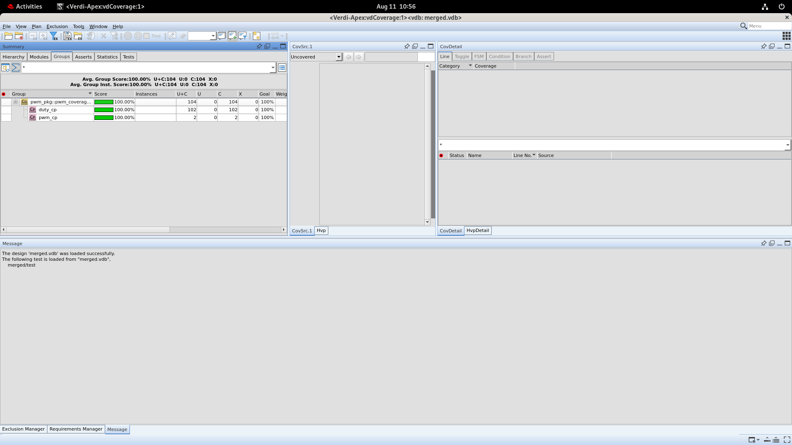
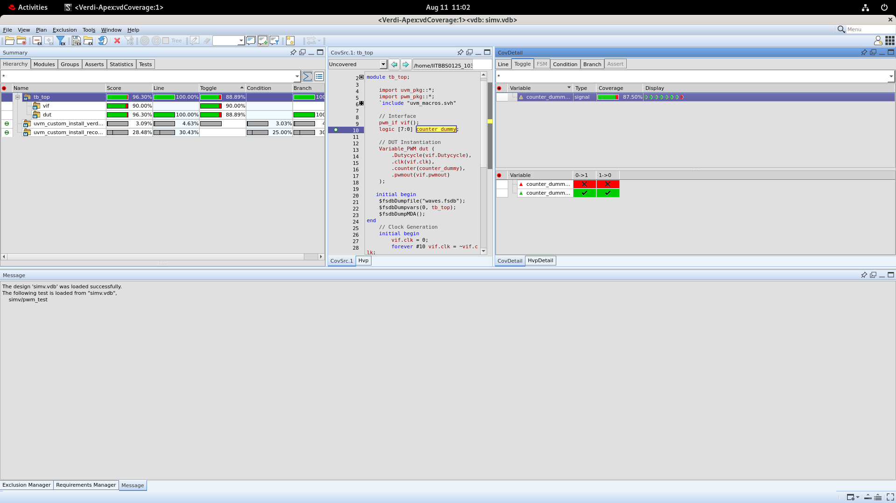

# PWM Generator — UVM Verification

A SystemVerilog UVM testbench verifying a variable-duty-cycle PWM generator, built with strict black-box methodology. Simulated on Synopsys VCS, analyzed with Verdi.

## Design Under Test

`Variable_PWM` — an 8-bit free-running counter (0–99, no reset) driving a combinational PWM output:

```verilog
always @(posedge clk)
  if (counter < 99) counter <= counter + 1;
  else               counter <= 0;

assign pwmout = (counter < Dutycycle);
```

## Verification Environment

Standard UVM agent-based architecture:

- **pwm_if** — interface carrying `clk`, `Dutycycle`, `pwmout` only. `counter` is deliberately not exposed.
- **pwm_transaction** — sequence item, `Dutycycle` (driven) / `pwmout` (observed), constrained to `[0:99]`.
- **Sequences** — one directed sequence per duty value (0/25/50/75/99), one directed sweep (0→99), one constrained-random sequence (5000 transactions).
- **pwm_driver / pwm_sequencer** — drive `Dutycycle`, hold for 100 clocks (one full PWM period) per transaction.
- **pwm_monitor** — samples the interface every clock edge, publishes observed transactions.
- **pwm_scoreboard** — black-box checker; see below.
- **pwm_coverage** — functional coverage: duty-value bins plus explicit rising/falling transition coverage.
- **Tests** — `pwm_test` (all sequences, one combined run) and 7 individual per-sequence tests, each runnable independently via `+UVM_TESTNAME`.

## The Bug: Scoreboard Reference-Model Drift

The scoreboard checks correctness without ever reading the DUT's internal `counter` — instead it maintains its own independent model (`ref_counter`), advanced by the same clock-driven rule as the real counter, and predicts the expected output from that model.

**The bug:** `ref_counter` was originally incremented once per *transaction* (every 100 clocks) instead of once per *clock*, causing it to drift out of sync with the real DUT counter and produce false failures.

**The fix:** the monitor now samples every clock edge (not once per 100), and the scoreboard advances `ref_counter` once per sample — keeping the independent model in permanent lockstep with the DUT, by induction from a shared `t=0` starting state (both start at 0, no reset, identical transition function).

## Results

| Metric | Result |
|---|---|
| Functional coverage (merged, all 7 tests) | 100.00% |
| Transition coverage (`inc`/`dec`) | Covered, ~499K hits each |
| Code coverage — Line / Branch | 100.00% / 100.00% |
| Code coverage — Toggle | 88.89% (MSB structurally unused — see below) |
| UVM_ERROR | 0 |

###Screenshots
**Merged functional coverage-100% across all 7 tests**



**code coverage on the dut**


**Toggle coverage note:** `Dutycycle` and `counter` are 8-bit (`[7:0]`, 0–255 representable) but the design only ever uses 0–99. The MSB (bit 7, weight 128) can never legally go high, so 7/8 bits fully toggle and the score plateaus at 88.89% — a structural property of the design, not a stimulus gap.

## Running It

```bash
# Compile once, with waveform + code coverage support
make WAVE=1 COV=1 compile

# Run the combined test (all 7 sequences, one simulation)
make run

# OR run each sequence as its own separate test
make regression

# Merge the 7 individual coverage databases into one
make merge
make mergereport      # opens merged.vdb in Verdi

# View waveforms
make waves

# View code coverage from the combined run
make covreport
```

## Repository Structure

```
pwm.v                  DUT
uvm/
  pwm_if.sv             interface
  pwm_transaction.sv    sequence item
  pwm_*_sequence.sv     7 stimulus sequences
  pwm_sequencer.sv
  pwm_driver.sv
  pwm_monitor.sv
  pwm_agent.sv
  pwm_scoreboard.sv     black-box checker
  pwm_coverage.sv       functional coverage
  pwm_env.sv
  pwm_test.sv           combined test
  pwm_*_test.sv         7 individual per-sequence tests
  pwm_pkg.sv            package, includes everything above
tb/
  tb_top.sv             simulation top module
Makefile
```

## Tools

Synopsys VCS · Verdi · UVM 1.2 · urg (coverage merge)
